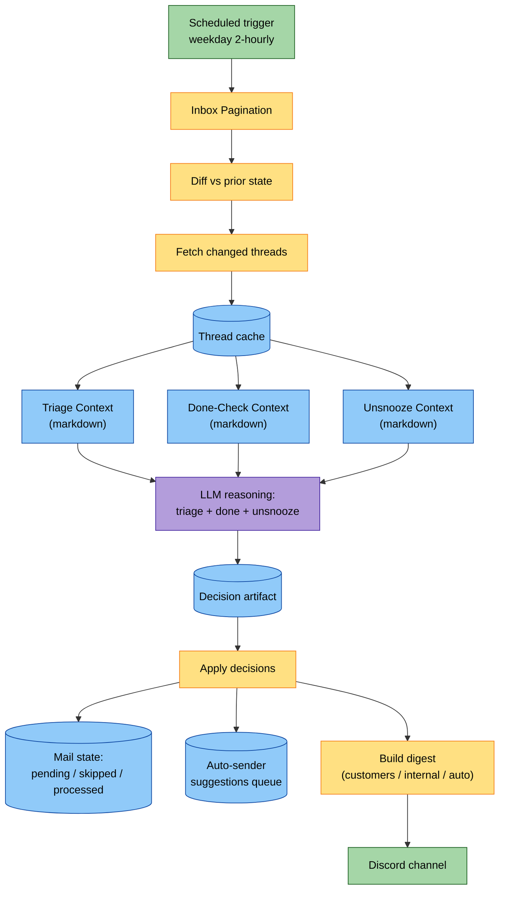
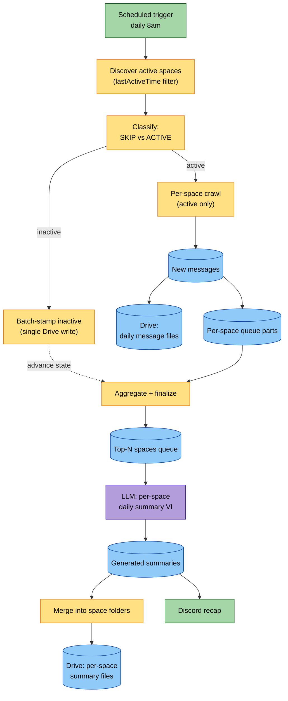
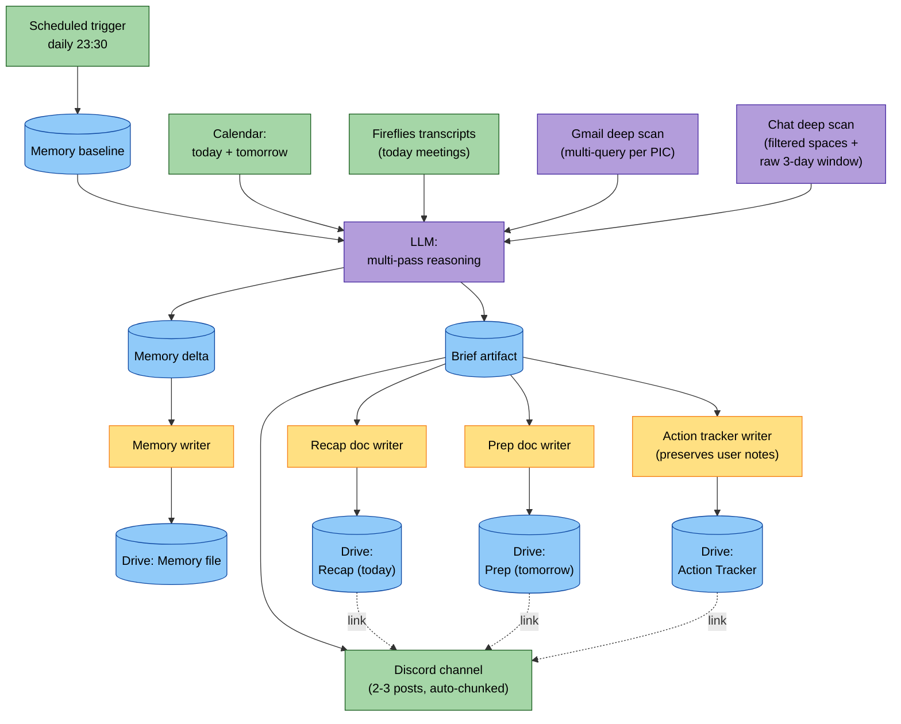
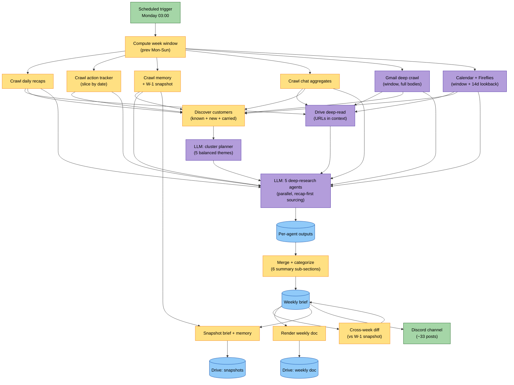
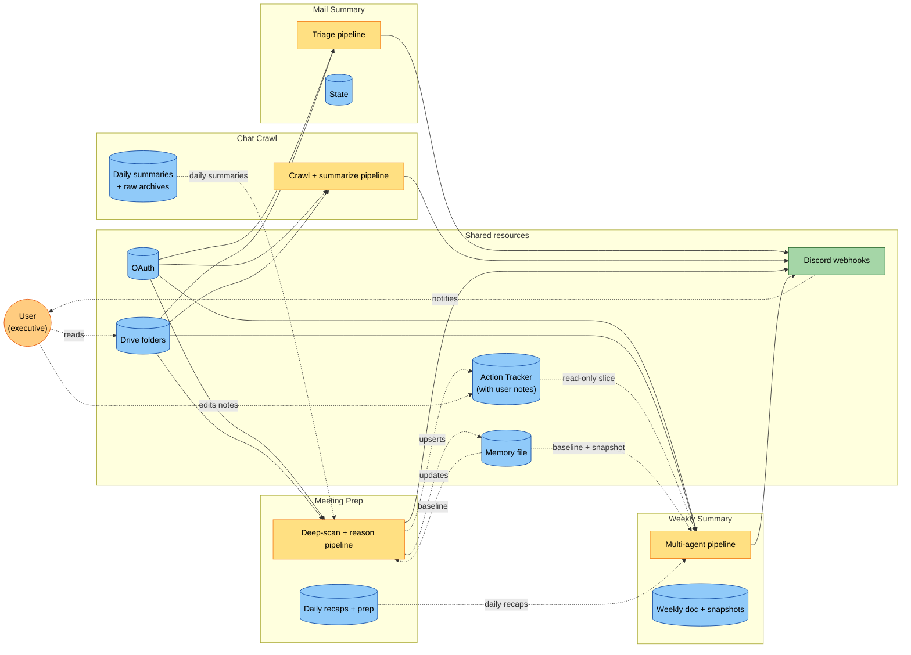

# VTI Daily Summary — Solution Proposal

## 0. Executive Summary

`vti-daily-summary` là một hệ thống information triage cá nhân, gồm bốn pipeline chạy theo lịch, phục vụ một executive duy nhất tại VTI APAC. Hệ thống đọc Gmail, Google Chat, Calendar, Fireflies, Drive — dùng LLM để phân loại, tổng hợp, và quyết định cần action gì — và trả về Discord notifications cùng Word documents trên Drive. Pattern thiết kế cốt lõi: **scheduled-script + LLM-reasoning + Drive-as-DB**, không có backend riêng, không có agent loop tự do.

## 1. Problem & Pain Points

### 1.1. Người dùng

Người dùng duy nhất là CEO của VTI APAC, đồng thời chịu trách nhiệm delivery leadership, business development cho thị trường Singapore + Nhật, client management cho 10+ tài khoản, và executive operations cho văn phòng. Khối lượng thông tin đầu vào mỗi ngày: hàng chục mail thread mới (tổng inbox active vài chục thread cùng lúc), hàng trăm tin nhắn Google Chat trên 200+ space, 2-4 meeting có Fireflies transcript, và Drive đầy attachment khách hàng gửi. Không có thư ký, không có chief of staff. Mọi context phải tự CEO mang theo.

Trước khi có hệ thống, người dùng dùng ~3 giờ/ngày để đọc inbox, skim chat, ghi note cho meeting tới. Action items từ meeting xa quên mất; commitment với khách hàng trong chat 3 tuần trước không có ai nhắc; persona của một stakeholder mới gặp 1 lần không lưu lại đâu — buổi sau lại bắt đầu từ con số 0.

### 1.2. Các pain point cụ thể

**P1 — Inbox quá nhiều, không thể triage thủ công mỗi giờ.** Một CEO không nhìn mail trong 2 tiếng có thể bỏ lỡ một câu hỏi từ khách hàng yêu cầu trả lời gấp. Triage thủ công ngay khi mail đến phá vỡ deep work; triage delayed bỏ lỡ red signals.

**P2 — Phân biệt "ai chờ ai" trong một thread là việc khó tự động hoá bằng rule cứng.** Một thread email có thể đồng thời: khách hàng chờ CEO reply, CEO chờ teammate gửi báo giá, và một bên thứ ba chỉ được CC để biết. Không phải cứ ai gửi mail cuối là người đó hoàn thành — "sẽ gửi tuần sau" không tương đương "đã gửi". Cần đọc nội dung và suy luận.

**P3 — Mention của CEO trong chat/email dễ bị miss khi không gắn @-mention chuẩn.** Trong văn hóa làm việc bilingual Việt-Anh, callout có thể là "Việt Anh ơi", "@Anh nhờ check", hoặc tên đầy đủ trong câu trần thuật. Một matcher đơn giản theo email address sẽ không bắt được.

**P4 — Action items mention trong meeting nhưng không xuất hiện trong mail hay chat.** Nhiều cam kết quan trọng chỉ được nói trong cuộc họp; Fireflies transcript là ground truth duy nhất. Bỏ qua transcript đồng nghĩa quên hẳn một cam kết — không có hệ thống nào nhắc lại.

**P5 — Chat history bị scatter qua 200+ space, không có full-text search nào tốt.** Tìm "lần cuối client X nói gì về Y" có thể mất 10 phút duyệt thủ công. Memory người không đủ để track 200+ space.

**P6 — Persona của stakeholder dễ quên giữa các lần gặp.** Một khách hàng process-driven (commit deadline cụ thể) cần được anchor bằng deadline; một khách hàng relationship-builder (transparent về cost) cần approach khác. Không có ghi chú persistent, lần gặp thứ hai bắt đầu lại từ đầu.

**P7 — Drift theo thời gian không được tracked.** Sentiment của một account tuần này so với tuần trước thay đổi như thế nào? Persona của một PIC sau 3 meeting có gì mới? Câu hỏi này không thể trả lời nếu không có snapshot tuần để diff.

### 1.3. Tại sao "thư ký AI on-demand" không giải quyết được

Một LLM chatbot mà người dùng phải mở app, type query, đọc câu trả lời — vẫn tốn thời gian và phụ thuộc người dùng nhớ phải hỏi. Pattern "tôi mở Claude và hỏi mỗi tối" không scale. Hệ thống phải **chủ động** đến với người dùng theo lịch, đúng định dạng, đúng channel anh ấy đã có sẵn (Discord).

## 2. Approach

### 2.1. Design philosophy

**Python lo phần xác định; LLM lo phần phán đoán.** Mỗi pipeline tách rõ hai loại công việc. Phần xác định (pagination, dedup, parsing, formatting, gửi Discord) viết bằng Python — chạy ổn định, idempotent, log được, debug được. Phần phán đoán (phân loại email, sinh summary tiếng Việt, đánh giá meeting risk, build persona) giao cho LLM, nhưng dưới dạng đọc context đã được Python pre-process. LLM không được tự ý gọi API ngoài; mọi nguồn data được Python crawl trước.

**Scheduled cadence thay vì on-demand chat.** Người dùng không phải mở chat app. Hệ thống chạy theo cron, đẩy output về Discord, ghi file lên Drive. Người dùng đọc khi rảnh. Cost token cố định theo lịch, không tăng theo độ "lười" hay "siêng" của người dùng.

**Drive làm system of record, không có database riêng.** Toàn bộ state (catalog space chat, persona memory, action tracker, daily recap, weekly archive) lưu trên Drive. Lợi ích: không tốn infra, người dùng có thể mở Drive xem trực tiếp, có thể edit notes column trong Excel mà không cần API. Trade-off: không có transactional guarantee — atomic write phải làm bằng tmp + rename.

**Markdown context files là "working memory" của LLM.** Mỗi pipeline có một thư mục context riêng. Python ghi markdown vào đây để LLM đọc; LLM ghi quyết định dưới dạng JSON vào đây để Python apply. Đây là handoff layer rõ ràng giữa hai loại reasoning. Cho phép tune prompt mà không động code, debug bằng cách mở file xem.

**Multi-cadence reinforcement.** Bốn pipeline chạy theo lịch khác nhau và output của pipeline sớm hơn là input của pipeline muộn hơn. Chat crawl chạy sáng 8 giờ; meeting prep chạy 23:30 và đọc chat summary mới nhất; weekly summary chạy thứ Hai 3 giờ sáng và aggregate cả tuần daily recap. Không pipeline nào solo; cả hệ thống là một chuỗi cộng dồn.

**Hard rules ở đầu prompt = past failures được encoded.** Mỗi rule "trước khi làm gì, áp dụng rule này" tương ứng một tình huống trước đây hệ thống làm sai. Pattern này cho phép tune iterative: phát hiện lỗi → thêm rule → không phải viết lại prompt.

### 2.2. Tại sao approach này thay vì các alternative

**RAG / vector DB bị từ chối** vì task cốt lõi không phải retrieval — không có câu hỏi nào dạng "tìm tài liệu nói về X". Task cốt lõi là classification (action type cho email), compilation (brief cho meeting), aggregation (recap cho 7 ngày). Embedding hàng nghìn thread mỗi ngày + hàng trăm chat space chỉ tốn token mà không thay đổi quyết định.

**Pure agent loop bị từ chối** vì state management khó kiểm soát qua bash timeout 45 giây của môi trường chạy. Một agent tự quyết "đọc tiếp file gì" khi crash giữa chừng rất khó resume. Pipeline có pre-process Python + LLM in-skill reasoning + post-process Python ngược lại cho cost cố định, retry rõ ràng, output deterministic.

## 3. Solution Overview

### 3.1. Bốn pipeline tóm gọn

| Pipeline | Cadence | Việc chính | Output |
|---|---|---|---|
| Mail Summary | Mỗi 2 giờ trong giờ làm | Triage inbox: ai chờ ai, hành động gì | Discord post phân nhóm khách / nội bộ / auto |
| Chat Crawl | Hàng ngày 8 giờ sáng | Crawl tin chat mới + sinh daily summary tiếng Việt mỗi space | JSONL raw + summary trên Drive + Discord recap |
| Meeting Prep | Hàng ngày 23:30 | Tổng kết meeting hôm nay + chuẩn bị meeting ngày mai | 2 file Word (Recap + Prep) + cập nhật Action Tracker + Memory + Discord 2-3 posts |
| Weekly Summary | Thứ Hai 3 giờ sáng | Tổng hợp toàn bộ tuần trước qua 5 deep-research agent | 1 file Word weekly + snapshot Memory + Discord ~33 posts |

### 3.2. Cách bốn pipeline phối hợp

Bốn pipeline không độc lập — chúng là một chuỗi cộng dồn context.

**Chat Crawl là tầng nền.** Daily summary của mỗi space chat trở thành nguồn đọc cho Meeting Prep tối hôm đó. Meeting Prep không cần re-crawl chat từ đầu; nó chỉ đọc summary đã được Chat Crawl curate sẵn cộng với raw message 3 ngày gần nhất khi cần dig sâu.

**Meeting Prep là tầng giữa.** Daily recap của Meeting Prep cộng với Action Tracker và Memory file là input chính cho Weekly Summary. Weekly Summary đọc 7 daily recap như "table of contents" cho tuần, rồi mới expand sang mail thread, chat space, Drive attachment liên quan.

**Memory file là sợi chỉ xuyên suốt.** Một file markdown tích lũy persona của mọi PIC từng xuất hiện, client context, opp stage. Meeting Prep cập nhật hằng ngày qua mechanism "replace section + append changelog". Weekly Summary snapshot mỗi tuần và diff với tuần trước — cách duy nhất tracking persona drift theo thời gian.

**Action Tracker là shared state có user write-back.** File Excel trên Drive với cột notes mà người dùng tự edit. Meeting Prep upsert daily nhưng tôn trọng cột notes — pattern này khiến hệ thống cảm thấy như tool cộng tác chứ không phải bot ghi đè.

## 4. Architecture

### 4.1. Per-app architecture

#### 4.1.1. Mail Summary

Mail Summary chạy mỗi 2 giờ trong giờ làm. Vòng lặp: paginate inbox, diff với state lần trước để biết thread nào mới hoặc có message mới, fetch chi tiết các thread đó, build markdown context cho ba loại quyết định riêng (triage cho thread mới, done-check cho action pending, unsnooze cho thread đã skip nay có động tĩnh). LLM đọc ba file context, ghi quyết định vào một file artifact duy nhất. Python apply quyết định lên state, format Discord digest, post lên webhook.



Điểm non-trivial: hệ thống có vòng feedback tự cải thiện auto-classifier. Khi LLM nhận diện một sender có dấu hiệu automation (no-reply pattern, marketing footer) nhưng chưa match regex hiện có, nó đề xuất một pattern mới vào hàng đợi suggestion. Người dùng review và promote tay sang config chính. Lần chạy sau, classifier bypass LLM cho sender đó. Đây là human-in-the-loop training mà không cần retrain model.

#### 4.1.2. Google Chat Crawl

Chat Crawl chạy hàng ngày 8 giờ sáng. Thử thách kỹ thuật chính: trên 200 space mà runtime mỗi bash call bị giới hạn 45 giây. Solution là tier hóa: một bước discover liệt kê tất cả space và filter theo lastActiveTime; một bước classify chia space thành nhóm "chắc chắn không có gì mới" (batch-stamp một lần duy nhất) và nhóm "có thể có message mới" (~10-30 space, crawl từng cái). Một bước finalize aggregate kết quả. LLM nhận top space theo activity, sinh daily summary tiếng Việt cho từng space.



Điểm non-trivial: classify trước, gọi API sau. Filter client-side dựa trên lastActiveTime trả về sẵn từ chính lúc list space — không cần gọi API thứ hai cho 180+ space "chắc chắn không có gì mới". Pipeline đi từ chỗ có thể 200 bash call (vượt timeout) xuống ~15 call (an toàn).

#### 4.1.3. Meeting Preparation

Meeting Prep chạy hàng ngày 23:30 — phần phức tạp nhất trong cụm. Mục tiêu: tổng kết meeting hôm nay + chuẩn bị meeting ngày mai với reasoning sâu nhất có thể. Quy trình: đọc memory baseline (persona, opp stage tích lũy), pull calendar today + tomorrow, lấy Fireflies transcript cho từng meeting hôm nay, scan Gmail sâu cho từng external PIC (nhiều query variant để bắt cả thread cũ), scan chat space liên quan qua bộ filter F1-F5 (theo PIC, theo account, theo opp keyword, theo activity gần, top frequent DM). Sau đó reasoning đa pass — extract signal, link cross-meeting, account-level pattern, persona refinement, sanity check.

Output là một artifact brief duy nhất, được bốn writer khác nhau consume: writer thứ nhất patch Memory file, writer thứ hai render Recap docx, thứ ba render Prep docx, thứ tư upsert Action Tracker. Cuối cùng Discord post với link tới cả bốn output.



Điểm non-trivial: brief artifact là single source of truth cho bốn writer. Mọi inconsistency (số meeting trong Recap khác Prep, action count khác Tracker) phải xuất phát từ brief, không phải từng renderer. Đây là cách enforce consistency: thay vì sửa bốn writer, sửa schema brief và sanity check.

#### 4.1.4. Weekly Summary

Weekly Summary chạy thứ Hai 3 giờ sáng — sâu nhất về reasoning. Sau khi crawl xong sáu nguồn (daily recap tuần, action tracker, memory với snapshot W-1, chat aggregate, Gmail window, Calendar + Fireflies 3 tuần lookback), một bước "discover customers" extract tất cả tên khách hàng được mention trong tuần. Sau đó một LLM agent đóng vai cluster planner — chia khách hàng thành năm nhóm balanced theme. Năm deep-research agent chạy song song, mỗi agent owns một nhóm khách hàng + nguồn data riêng, sourcing theo thứ tự "recap-first" (đọc daily recap trước, rồi mới expand sang mail/chat/drive cụ thể).

Output của năm agent được merge, normalize, build summary 6 H3 sub-section (decisions / meetings / new opps / blockers / internal ops / customers activity). Một bước diff với snapshot brief tuần trước emit cross-week delta. Cuối cùng render Word doc + snapshot Memory + post ~33 Discord message.



Điểm non-trivial: cluster planner trước, agents sau. Thay vì hardcode "agent A xử lý KGI và Ufinity, agent B xử lý AsiaPac..." (sẽ lỗi thời mỗi tuần khi khách hàng thay đổi), một LLM agent đầu tiên đọc danh sách khách hàng tuần này và quyết định cách chia. Năm agent tiếp theo nhận cluster definition từ output của planner. Mỗi tuần cluster có thể khác — bám theo nội dung tuần, không bám theo template.

### 4.2. Cluster-level architecture



Cluster không phải bốn tool độc lập. Mũi tên dashed thể hiện data feeding: Chat Crawl tạo daily summary cho Meeting Prep tiêu thụ; Meeting Prep tạo daily recap cho Weekly Summary tiêu thụ; Memory file là shared state hai chiều, được Meeting Prep update và Weekly Summary snapshot.

### 4.3. Shared resources

Hệ thống dùng một OAuth credential cho cụm (Chat Crawl giữ riêng vì scope rộng hơn). Drive được tổ chức ba root folder ở cấp người dùng: một folder cho daily output (chứa Recap, Prep, Action Tracker, Memory), một folder cho chat archive (per-space subfolder), một folder cho weekly archive (per-week subfolder, có thư mục snapshot riêng). Webhook Discord chia bốn channel — mỗi pipeline một channel — để người dùng có thể mute từng channel độc lập.

## 5. Tech Stack

| Layer | Technology | Note |
|---|---|---|
| Language | Python 3 | Toàn bộ pipeline; type hints |
| Auth | Google OAuth 2.0 | Một flow cho ba project; relax token scope check |
| Storage | Google Drive (scoped) | Atomic write qua tmp + rename; không có DB riêng |
| Reasoning | Anthropic Claude qua scheduled tasks | LLM in-skill, không có wrapper API riêng |
| Scheduling | Scheduled tasks (cron-style) | Mỗi pipeline 1 task, lịch riêng |
| Notification | Discord webhooks | Plain-text multi-post, không dùng embed |
| Document rendering | python-docx, openpyxl | Word/Excel native; Drive giữ format khi download |
| External APIs | Gmail, Chat, Calendar, Drive, Fireflies | Mix MCP + REST tuỳ pipeline |

## 6. Design Insights

**Auto-sender feedback loop.** Khi LLM gặp sender có dấu hiệu automation nhưng chưa match classifier hiện có, nó đề xuất một regex vào hàng đợi suggestion. Người dùng review tay và promote sang config chính nếu đồng ý. Lần chạy sau, classifier deterministic bypass LLM cho sender đó. Đây là cách tự-train classifier mà không retrain model — và quan trọng là **suggestion không bao giờ auto-apply**, người dùng giữ quyền veto.

**Action Tracker notes column là không gian thiêng.** File Excel có một cột "Notes (your space)" mà người dùng tự edit. Khi pipeline upsert action row hằng ngày — có thể update status, deadline, task description — nó tracked notes cũ và không touch. Đây là contract ngầm: pipeline làm việc của pipeline, user làm việc của user, hai bên không đè lên nhau. Pattern này khiến hệ thống cảm thấy như một cộng tác viên có kỷ luật chứ không phải một bot ghi đè.

**Marker-based renderer contract.** Trong Meeting Prep, khi LLM viết đánh giá meeting, prompt bắt nó dùng các marker như `[likely]`, `[possible]`, `Risk:`, `Michael nên`. Renderer split text tại các marker này thành nhiều bullet riêng. Đây là cách enforce readability mà không cần parse natural language — chỉ dùng convention prompt-side. LLM ngại cấu trúc → output là một đoạn dài khó đọc; LLM tuân thủ → renderer ra multi-bullet rõ ràng.

```python
patterns = [
    (r'\s+\[likely\]', '\n[likely]'),
    (r'\s+\[possible\]', '\n[possible]'),
    (r'\.\s+Risk:', '.\nRisk:'),
    (r'\.\s+Michael n[êe]n', lambda m: '.\n' + m.group(0).lstrip('. ').strip()),
]
work = text
for pat, repl in patterns:
    work = re.sub(pat, repl, work)
segments = [s.strip() for s in work.split('\n') if s.strip()]
```

**Cluster planner trước deep agents.** Weekly Summary từng bị trap khi hardcode "agent A xử lý nhóm khách hàng X, agent B xử lý nhóm Y" — danh sách khách hàng thay đổi mỗi tuần. Giải pháp: một LLM agent đầu tiên đọc danh sách khách hàng tuần này và quyết định cách chia balanced theo theme. Năm agent deep-research sau nhận cluster definition từ planner. Pattern này giải kết hardcoded routing — mỗi tuần cluster có thể khác.

**Hard rules ở đầu prompt encode past failures.** Mỗi rule "trước khi đọc thread, áp dụng rule này" tương ứng một sai sót trước đây. Pattern này cho phép tune iterative — sai mới, thêm rule mới, không phải viết lại toàn bộ prompt. Trade-off: prompt dần dài ra, có lúc cần refactor.

## 7. Case Study — Một ngày của người dùng

Bối cảnh: thứ Năm 14/05/2026, ba meeting hôm nay, bốn meeting ngày mai.

**06:50** — Người dùng thức dậy, mở Discord. Channel mail và chat chưa có post mới — Mail Summary chạy đầu tiên 7:00.

**07:00** — Mail Summary chạy. Pipeline paginate inbox, diff với state đêm trước, fetch chi tiết bảy thread đã thay đổi. LLM đọc context, phân loại: ba thread Ufinity team đêm muộn (BRD update từ Mark Choon, priority đỏ vì có meeting 10:00 mai), một thread NxGen theo dõi RFI (priority vàng), một thread internal VAP, hai action pending đã được trả lời xong. Discord post 1.8 KB phân nhóm KHÁCH HÀNG / NỘI BỘ / AUTO.

**07:02** — Discord ping. Người dùng đọc trong khi pha cà phê. Một thread newsletter HR được flag là auto — anh apply label skip, lần sau bypass LLM.

**08:02** — Chat Crawl chạy. Trên 200 space, sau bước classify còn 20 space active. Pipeline crawl từng cái, append daily message file vào Drive, sinh summary tiếng Việt cho top 12 space, post recap lên channel chat.

**09:00** — Mail Summary chạy lần hai. Mười hai thread mới so với 7:00.

**11:00** — Meeting NxGen RFI với Ian Choy (NxGen) và Kevin Nguyen. Walkthrough năng lực AI/ML, case study Aura chatbot. Quyết định: VTI submit budgetary proposal trong 1 tuần. Action items: Ian gửi RFI data 18/05; người dùng viết note kỹ thuật cho Section 4 deadline 21/05; Kevin chuẩn bị proposal doc 21/05. Fireflies bot ghi transcript.

**13:00 và 15:00** — Mail Summary chạy. 15:00 cũng có meeting EP Agreement với Karin (Recruit Express): walkthrough costing chi tiết, EP vendor fee bracket, quyết định Recruit Express là vendor preferred.

**17:00** — Mail Summary chạy lần cuối ngày làm.

**22:00** — Người dùng mở Action Tracker trên Drive, thêm note tay vào hai row: "đã gọi Cuong xác nhận", "đợi Anthony reply".

**23:30** — Meeting Prep chạy. Pipeline đọc memory baseline, pull calendar today + tomorrow, lấy ba Fireflies transcript hôm nay, scan Gmail sâu cho từng external PIC (Ian, Karin, Mark Choon, v.v.) qua nhiều query variant để bắt cả thread cũ, scan chat space liên quan qua bộ filter. LLM chạy đa pass reasoning: extract signal, link cross-meeting (Mobile roadmap có thể raise lại trong meeting Ufinity 15/05), pattern account-level (NxGen deadline-driven), persona refinement (Karin transparent walkthrough → relationship-builder; Ian structured + responsive → process-driven), sanity check. Compile brief với 3 meeting hôm nay + 4 meeting ngày mai + 7 action + 5 persona refreshed.

Bốn writer chạy tuần tự: patch Memory file (thêm persona Karin + Ian stub, append changelog), render Recap docx (9 trang), render Prep docx, upsert Action Tracker (hai row của user preserved notes lúc 22:00). Post 2-3 Discord, auto-chunk nếu vượt 1900 chars.

**23:42** — Discord ping. Người dùng đọc nhanh hai post: tổng kết hôm nay + chuẩn bị Ufinity BRD walkthrough sáng mai (chuẩn bị Architecture diagram v3 deadline 09:30 sáng).

**Thứ Hai tuần sau 03:00** — Weekly Summary chạy. Sau khi crawl xong sáu nguồn, discover customer extract 19 khách hàng (12 known active, 3 new, 4 carried RED). Cluster planner chia thành 5 nhóm theme balanced. Năm agent deep-research chạy song song, mỗi agent owns một cluster, sourcing recap-first. Merge output, build summary 6 sub-section, cross-week diff với snapshot W-1 (12 customer updated, 3 no_update, 2 dropped, 4 new). Render Weekly doc, snapshot Memory + brief, post ~33 Discord rate-limit 1.2 giây/post.

**Thứ Hai 06:50** — Người dùng thức dậy, đọc Weekly recap, quyết định 5 priority cho tuần tới.

**Không có hệ thống**, một ngày như thứ Năm 14/05 sẽ trông khác: 2-3 giờ buổi sáng + buổi tối đọc inbox + skim chat, action items NxGen mention trong meeting bị quên (transcript không được aggregate), Ufinity BRD đêm muộn bị miss sáng (không có Mail Summary chạy 7:00), persona Karin không lưu lại đâu, tuần qua tuần không có cách diff persona drift. Mỗi pain point ở §1.2 trở thành 1 cú miss thực tế.

## 8. Limitations

**Chat full-text search vẫn là brute-force.** Không có index — tìm một keyword qua 200 space × 14 ngày là duyệt sequential. Workaround dùng curated summary trước, drill xuống raw sau, nhưng nếu LLM trừu xuất topic chưa chuẩn, search miss.

**Auth refresh fail là silent.** Khi OAuth token expire hoặc bị revoke, pipeline crash hoàn toàn. Không có alert chủ động — phát hiện chỉ qua log hoặc thiếu Discord post. Health-check + alert là gap rõ nhất.

**Race condition không tồn tại vì design tách bạch state.** Nhưng nếu người dùng trigger thủ công Chat Crawl gần 23:30, Meeting Prep có thể đọc partial-updated summary. Hiện không có locking; mitigation chỉ là khoảng cách lịch.

**Cluster planner reasoning là single point of failure cho Weekly.** Nếu planner chia cluster sai (customer bỏ sót, theme không hợp), năm agent sau xuống cấp toàn bộ. Hệ thống có guard coverage check nhưng không có self-evaluation sâu hơn.

**Memory file không có schema validation.** Người dùng (hoặc LLM ghi sai) có thể tạo section ma. Cross-week diff fuzzy-match dựa trên text similarity — schema sai không crash nhưng giảm độ tin cậy.

**Cluster không có CI/CD hay test harness.** Tất cả test qua dry-run thủ công. Phù hợp scale cá nhân; không phù hợp nếu mở rộng team.

## 9. Glossary

- **Cowork** — môi trường Anthropic chạy scheduled Claude task, mỗi task có lịch + prompt + tool permissions.
- **Recap** — Word doc tổng kết meeting hôm nay.
- **Prep** — Word doc chuẩn bị meeting ngày làm việc kế tiếp (weekend → Monday).
- **Triage** — phân loại email thread thành action_type: reply / push_member / external_action / info.
- **Done check** — kiểm tra action pending có thực sự xong chưa, dựa nội dung tin mới chứ không dựa sender.
- **Unsnooze** — thread đã skip nay có động tĩnh mới, hệ thống bật lại theo dõi.
- **Tier-1 auto** — single-message thread từ sender match auto-classifier regex → bypass LLM, hiển thị compact.
- **F1-F5 filter** — năm cách filter chat space liên quan meeting: theo PIC, theo account, theo opp keyword, theo activity gần, top frequent DM.
- **Recap-first sourcing** — Weekly Summary sub-agent đọc daily recap trước, rồi mới expand sang mail/chat/drive cụ thể.
- **Drive-as-DB** — pattern dùng Google Drive làm state store + content store + sharing layer, không có database backend.
- **Memory diff** — so sánh Memory file hiện tại với snapshot tuần trước qua fuzzy match.
- **Cluster planner** — LLM agent đầu tiên trong Weekly Summary, chia khách hàng tuần này thành cluster balanced cho năm deep-research agent.
